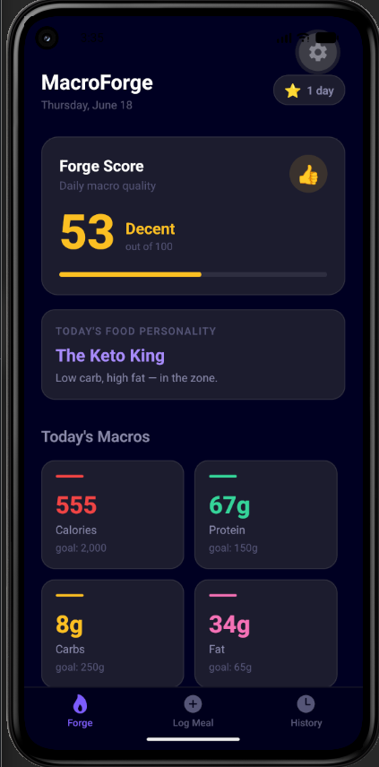

# MacroForge



MacroForge is a React Native (Expo) app that transforms macro tracking into something actually interesting. Instead of just logging numbers, it scores your daily nutrition, gives your meals personality tags, and tracks your streak.

## Features

- **Forge Score** — Rates your daily macro balance from 0–100 with ranks like "Legendary" or "Elite"
- **Meal Personality** — Every meal gets auto-tagged (e.g. "Protein Powerhouse", "Carb Loader")
- **Daily Food Personality** — End-of-day summary title based on your eating pattern
- **Streak Tracking** — Consecutive logging days tracked with visual badges
- **Meal Type & Mood** — Log by meal time (breakfast/lunch/dinner/snack) and how you felt
- **Glassmorphism UI** — Dark, modern design with animated micro-interactions

## Tech Stack

- [Expo SDK 55](https://docs.expo.dev/versions/v55.0.0/)
- [Expo Router](https://docs.expo.dev/router/introduction/) (file-based navigation)
- TypeScript
- AsyncStorage for local persistence

## Prerequisites

- Node.js >= 18
- npm
- Android device/emulator or iOS simulator

## Setup

1. Install dependencies:

   ```bash
   npm install
   ```

2. Start the dev server:

   ```bash
   npx expo start
   ```

3. Scan the QR code with Expo Go or open in a simulator.

## Scripts

| Command                  | Description            |
| ------------------------ | ---------------------- |
| `npm start`              | Start Expo dev server  |
| `npm run android`        | Run on Android         |
| `npm run ios`            | Run on iOS             |
| `npm run web`            | Start with web support |
| `npm run lint`           | Run ESLint             |

## Project Structure

```
src/
  app/          — Expo Router routes
  components/   — Reusable UI components
  storage/      — AsyncStorage helpers
  styles/       — Colors and shared styles
  utils/        — Forge Score, personality engine
```
